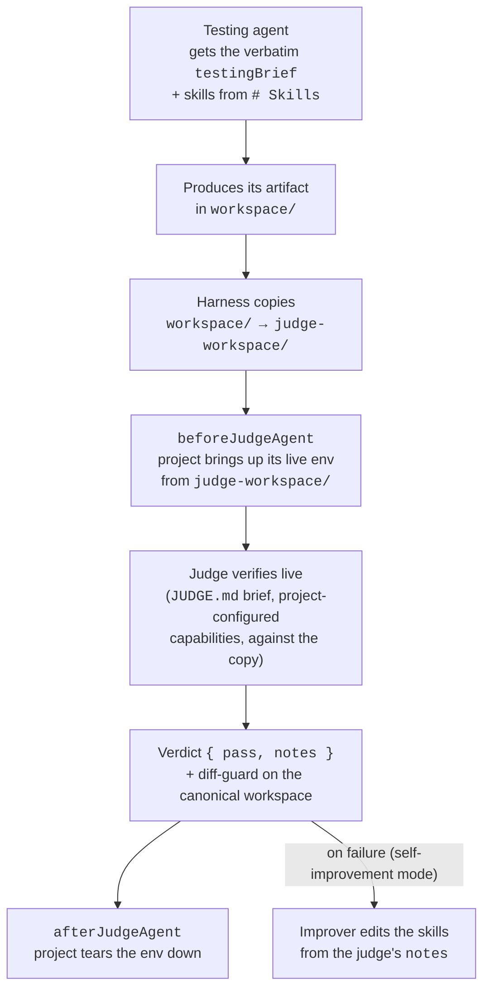

# Skillsmith

Landing page: <https://automattic.github.io/skillsmith/>

Skills are how we teach LLMs our domains — and today we ship them based on subjective review. Skillsmith is a harness with two parts: it **tests** a skill by sending prompts to an LLM and checking whether the resulting answer actually works, end-to-end in a real runtime, across models. When a test fails, a **self-improvement loop** kicks in: an agent edits the skill, re-runs the tests, and iterates until it passes — then opens a PR for human review. For anyone who builds, improves, or maintains a skill.

## The problem

Skills are now how we teach LLMs our domains. Every skill we ship determines the quality of the code and answers our teammates and users get. As skills proliferate, their defects compound.

Today, skills are written as prose and reviewed subjectively. We cannot systematically answer the questions that actually matter:

- Does this skill produce working output, end-to-end, when a real LLM consumes it?
- Did my latest edit to a reference file break anything?
- Does the skill hold up across models and across vendors?

Prose review cannot catch this. We need a test loop.

## Two parts

**Skill Tester.** Each test case is a **scenario** — two prose briefs in a folder: a testing-agent brief (the request a user or agent would send) and a judge brief (how to verify the result). The pipeline sends the testing brief to an LLM loaded with the skill, captures the artifact it produces, and hands the judge brief to a judge that verifies the artifact **live** against a project-owned environment. The output is a pass/fail matrix per **(skill × model × scenario)**.

**Self-Improvement Harness.** When tests fail, a single improver agent reads the failure trace, edits the skill files in place, re-runs the tests, and iterates (capped) until the suite passes or it gives up. It leaves the edits in the working tree alongside the full evidence trail, ready to review and open as a PR.

> [!IMPORTANT]
> **Breaking change — no backward compatibility.** Scenarios are now defined by two prose files (`TESTING-AGENT.md` + `JUDGE.md`), and the judge verifies behavior live. The old model is gone: there is no `scenario.yaml`, no separate `prompt` files, no `acceptance`/`prompt`/`description` scenario fields, and no bundled Playwright/`e2e.spec.mjs` gate. The `Scenario` and `Paths` types changed shape, and the judge verdict is now `{ pass, notes }`. Rubrics survive in a leaner form: instead of the old per-rubric scoring grid, a `JUDGE.md` may **reference reusable rubrics by id** (see [Reusable rubrics](#reusable-rubrics)), resolved from an optional `paths.rubrics` location — the verdict is still a single `{ pass, notes }`. If you are migrating off the old model, see [Migrating from the old model](#migrating-from-the-old-model).

## How the Skill Tester works

The harness runs every scenario against every configured testing agent by default. A **scenario** is a folder under `config.paths.scenarios` holding two self-contained prose files: a **testing-agent brief** (`TESTING-AGENT.md`) and a **judge brief** (`JUDGE.md`). Both files are passed through to the relevant agent verbatim as prompt text — the only structure Skillsmith parses is a required `# Skills` section in the testing brief (see [Scenarios are two briefs](#scenarios-are-two-briefs)). A **testing agent** is a configured (model, tools, system) tuple. Scenarios run in parallel; within each scenario, testing agents run in parallel.

### Scenarios are two briefs

A scenario lives in its own folder and is two files, both required:

```
eval/scenarios/
└── counter/
    ├── TESTING-AGENT.md   # the task handed to the testing agent
    └── JUDGE.md           # how the judge verifies the result
```

- **`TESTING-AGENT.md`** is the testing agent's prompt. Apart from one required section, its contents are opaque to Skillsmith — write it as whatever instructions the agent needs. The one structural rule: it must contain a `# Skills` section listing the skill ids the scenario exercises, as a Markdown list. Skillsmith parses that section, loads each listed skill's `SKILL.md` into the testing agent's context, and reports a clear error if a skill id does not resolve. An empty `# Skills` section (zero skills) is valid; a missing one is an error.

  ```md
  Build an interactive counter block. The page renders a number and a
  button; clicking the button increments the number.

  # Skills

  - wp-interactivity-api
  ```

- **`JUDGE.md`** is the judge's prompt. It is entirely opaque to Skillsmith — freeform prose you write to ask the judge for whatever you want verified. See [The judge brief](#the-judge-brief).

A directory is treated as a scenario only when **both** briefs are present. A folder with neither is not a scenario (so grouping folders may nest scenarios beneath them); a folder with exactly one brief is a misconfiguration and surfaces as an errored scenario naming the missing file. Validation problems — a missing brief, a missing `# Skills` section, an unknown skill id — never abort the run: the bad scenario is reported with its error and the rest of the run proceeds.

### Usage

Run all scenarios:

```sh
skillsmith
```

Run one or more targeted scenarios by scenario ID or parent folder under `config.paths.scenarios`:

```sh
skillsmith counter
skillsmith blocks/counter
skillsmith blocks config-fetch
```

Scenario IDs are the scenario directory path relative to `config.paths.scenarios`, normalized with `/` separators. A flat scenario at `scenarios/counter/` (holding `TESTING-AGENT.md` + `JUDGE.md`) is `counter`; a nested scenario at `scenarios/blocks/counter/` is `blocks/counter`.

CLI positionals and API `run({ scenarios })` use the same scenario-or-folder filters. An exact filter such as `blocks/counter` selects that scenario. A parent folder filter such as `blocks` selects every discovered scenario below `blocks/` in deterministic scenario ID order. Pass `.` or `./` to select the scenarios root, equivalent to running all discovered scenarios.

```ts
await run({ scenarios: ["blocks/counter"] });
await run({ scenarios: ["blocks", "config-fetch"] });
```

Scenario selection trims each positional/API value and normalizes harmless spelling variations: `./counter`, `counter/`, repeated separators such as `foo//bar`, and Windows separators such as `foo\bar`. Duplicate and overlapping filters are de-duped, so `counter`, `./counter`, and `counter/` run `counter` once, and `blocks blocks/counter` does not run `blocks/counter` twice. Empty selections run all scenarios. Empty, unsafe, or unknown filters fail before any hooks or agent work runs; unknown-filter errors list the available scenario IDs and explain that parent folders are accepted. Filters match scenario IDs and parent folders — a scenario's name equals its ID, so there is nothing else to match against.

Unsupported option-like arguments such as `--scenario` fail before a run starts.

Project-specific behaviour is exposed through **hooks**. Each fork implements only the hooks it needs against the harness's runtime contract.




### Lifecycle

1. **Init run.** Generate `runId`, load scenarios from `config.paths.scenarios` (each scenario discovered from its `TESTING-AGENT.md` + `JUDGE.md` pair), and apply any positional scenario-or-folder filters before hooks or agent work start. A scenario's `name` equals its source ID, so names are unique by construction — there is no duplicate-name check.
2. **`beforeAll({ config, runId, scenarios })`**. `scenarios` is the filtered list of selected scenario records. Each record exposes the normalized source ID relative to `config.paths.scenarios` as `id`, the directory-name alias `dirName` (equal to `id`), and the parsed scenario body as `scenario` (`{ name, skills, testingBrief, judgeBrief }`).
3. **Iteration directory.** Create `${runDirectory}/iteration-N/`. Test-only mode runs exactly one iteration; self-improvement mode (see below) may run more, each with its own subdirectory.
4. **Scenario loop — parallel.** For each scenario:
   1. **Init scenario.** Create the scenario directory inside the current iteration using `scenario.name`, load testing agents from `config.roles.test.agents` and the judge from `config.roles.judge` (both resolved against the top-level `config.agents` registry).
   2. **`beforeScenario({ config, runId, scenario })`**.
   3. **Agent loop — parallel.** For each testing agent:
      1. **Init agent.** Create the agent directory and `agentWorkspace`.
      2. **`beforeTestAgent({ ..., scenario, agent, agentWorkspace, judgeWorkspace })`**.
      3. **Testing agent.** Receives the verbatim `testingBrief` as its prompt, plus the skills named in `# Skills` and `agentWorkspace`; writes its artifact into the workspace.
      4. **`afterTestAgent({ ..., agentWorkspace, judgeWorkspace })`**.
      5. **Copy workspace.** The harness copies `agentWorkspace` (`workspace/`) to a sibling `judgeWorkspace` (`judge-workspace/`). The judge runs against the copy, so it structurally cannot modify the artifact the testing agent produced.
      6. **`beforeJudgeAgent({ ..., agentWorkspace, judgeWorkspace })`**. Where the project stands up the live environment the judge needs — built from `judgeWorkspace`, the copy the judge sees (see [Environment ownership](#environment-ownership-and-judge-concurrency)).
      7. **Judge agent.** Receives the verbatim `judgeBrief` as its system prompt and runs with `cwd` set to `judgeWorkspace`, using the project-configured judge capabilities, verifying behavior against the live environment; produces a `{ pass, notes }` verdict.
      8. **Agent report.** The harness writes `report.json` to the agent directory: a `testing` block with the testing agent's wall-clock `duration` (ms) and, when the provider reports it, `tokenUsage` (`inputTokens` — gross prompt size including the cache-read portion; `cachedInputTokens` — the subset that was served from the prompt cache; `outputTokens`; `totalTokens` = `inputTokens + outputTokens`); plus the judge's verdict stored verbatim under `review` (the `{ pass, notes }` shape — see [Per-iteration reports](#per-iteration-reports)).
      9. **`afterJudgeAgent({ ..., agentWorkspace, judgeWorkspace })`**. Where the project tears the environment back down.
   4. **Scenario report.** The harness aggregates every agent's `report.json` into the scenario's `report.json`.
   5. **`afterScenario({ config, runId, scenario })`**.
5. **Iteration report.** The harness aggregates every scenario's `report.json` into `iteration-N/report.json` and writes the merged matrix across iterations to `${runDirectory}/report.json` plus an iteration roster to `${runDirectory}/run.json`. Scenario entries in these reports are keyed by `scenario.name` (which equals the source ID).
6. **`afterAll({ config, runId, scenarios, iterations })`**.

When the judge is configured `serial` (see [Environment ownership](#environment-ownership-and-judge-concurrency)), the whole `beforeJudgeAgent` → judge → `afterJudgeAgent` bracket runs under one run-wide lock, so no two pairs grade at once; the testing phase stays fully parallel regardless.

### Hook examples

Projects opt into the hooks they need. A few examples from the WordPress reference project:

**`beforeTestAgent` — scaffold the artifact the agent will edit.** Generates a plugin skeleton inside `agentWorkspace` with a deterministic slug derived from `scenario.name` and `agent.id`, so the judge's live environment can activate it later.

**`beforeAllScenarios` / `afterAllScenarios` — boot the shared environment once per run.** `beforeAllScenarios` starts a single `wp-env` and keeps it warm for the whole sweep; `afterAllScenarios` stops it and clears the host state it owns. The environment is booted once, not per pair.

**`beforeJudgeAgent` / `afterJudgeAgent` — give each pair a clean slate on that one environment.** `beforeJudgeAgent` builds the plugin from `judgeWorkspace` (the copy the judge sees), installs it into the already-running environment, deactivates every other plugin and activates this pair's so only its plugin is live, and exports the per-pair facts the judge reads to reach the environment (the project root, the port, and the plugin slug) as environment variables. `afterJudgeAgent` deactivates the pair's plugin and removes it, leaving the environment up and clean for the next pair — it does not tear the environment down. The harness owns this deterministic infrastructure (boot, build, install, clean slate, and a reliable bridge into the environment); the live behavioral setup — discovering and inserting the produced block(s), opening the page, and verifying — is the judge's job, driven from the plain-language `JUDGE.md` brief, so the harness no longer pre-creates a post or hands over a fixed URL. Because the reference project shares a single `wp-env` that cannot run two instances at once, it sets `roles.judge.concurrency: 'serial'` so only one pair is staged on that environment at a time. See [Environment ownership and judge concurrency](#environment-ownership-and-judge-concurrency).

### The judge brief

The judge runs the `JUDGE.md` brief against the artifact the testing agent produced **and** the live environment the project stood up. The brief is freeform prose — apart from one optional `# Rubrics` section (see [Reusable rubrics](#reusable-rubrics)), Skillsmith imposes no structure on it and never resolves links inside the prose. Write it to ask for whatever you need verified: a code review against your conventions, a per-scenario acceptance checklist, live UX checks (load a page, click a button, read the console), command output — anything the judge's configured capabilities can reach. Shared grading criteria you do not want to repeat in every brief can live in a [reusable rubric](#reusable-rubrics) the brief references by id, rather than being pasted into the file.

The judge returns a single overall pass/fail plus freeform `notes`. There is no machine-readable per-check breakdown; `notes` carries every reason and observation, and a vague brief yields a vague verdict, so it pays to be specific about what "correct" means.

**The judge cannot modify the artifact.** Before the judge runs, the harness copies `workspace/` to a sibling `judge-workspace/` and runs the judge with `cwd` set to that copy. The artifact of record — the files the testing agent wrote, and the source the reports and improver read — is never exposed to the judge, so the judge cannot alter it regardless of which tools it holds (a snapshot diff-guard around the judge phase fails the pair as a backstop if anything mutates the canonical workspace anyway).

**The judge does not read the skill.** The agent learns from the skill; the judge grades from the `JUDGE.md` brief and what it observes live. Keeping them epistemically separate is what lets the harness catch a regression in the skill itself — if the judge consulted the same skill the agent did, a bad skill edit would simultaneously redefine "correct" and the regression would slip through.

### Reusable rubrics

When the same grading criteria recur across scenarios — a house style guide, a best-practices checklist — you can author them once and **reference them by id** instead of pasting the same prose into every `JUDGE.md`. A rubric is reusable grading **content**, not a structured scoring grid: the judge still returns a single overall `{ pass, notes }` verdict (see [The judge brief](#the-judge-brief)), and there is no per-rubric machine-readable breakdown.

Referencing rubrics is **optional**. A `JUDGE.md` with no `# Rubrics` section is valid and the judge grades on the freeform brief alone; add the section only when you want shared content pulled in.

A `JUDGE.md` references rubrics with a `# Rubrics` section — the same Markdown-list grammar as the testing brief's `# Skills` section. Each list item is a rubric id:

```md
Grade the produced block against the requirements below, using both the
source and the live page.

# Rubrics

- wp-interactivity-api-best-practices
```

Each id resolves to a flat `<id>.md` file under the rubrics directory configured by [`paths.rubrics`](#configuration). The id `wp-interactivity-api-best-practices` resolves to `<paths.rubrics>/wp-interactivity-api-best-practices.md`. At grading time Skillsmith loads each referenced rubric's content (plus any Markdown-linked companion files that resolve inside the rubrics directory) and supplies it to the judge automatically, under a `# Grading rubrics` heading in the judge's system prompt — you do not paste it into the brief and the judge does not have to go find it. The literal `# Rubrics` id list stays in the brief; the resolved content is what the judge grades against.

`paths.rubrics` is optional and has no default. A project only declares it when it uses rubrics, and the directory is required to exist only then (see [Configuration](#configuration)). If a `JUDGE.md` references a rubric id that does not resolve to a file, that scenario is reported with a clear error and runs no agents — the same keep-but-skip-and-fail behavior as an unknown skill id (validation problems never abort the rest of the run).

### Environment ownership and judge concurrency

**The project owns the environment, not Skillsmith.** Skillsmith never starts or stops a server, browser, or container. When the judge needs to exercise a live environment, the project stands it up in its hooks — the run-level `beforeAllScenarios` / `afterAllScenarios` hooks for anything shared across the whole sweep, and the per-pair `beforeJudgeAgent` / `afterJudgeAgent` hooks for whatever each pair needs in place before its judge grades. `beforeJudgeAgent` is the first per-pair point in the lifecycle where the produced artifact exists (the testing agent has run) and the environment can be ready before the judge grades; both per-pair hooks receive `judgeWorkspace`, so the project builds against the same copy the judge sees. This hook set is unchanged — only how the reference project uses it has.

The reference WordPress project splits the work along that boundary. It boots a single `wp-env` **once per run** in `beforeAllScenarios`, keeps it warm across every pair, and stops it in `afterAllScenarios` — not a boot-and-teardown per pair. Per pair, `beforeJudgeAgent` builds the produced plugin from `judgeWorkspace`, installs it into that one running environment, and guarantees a clean slate (only this pair's plugin active) before the judge runs; `afterJudgeAgent` removes the pair's plugin and leaves the environment up for the next pair. The harness keeps only the deterministic infrastructure — boot, build, install, the clean-slate guarantee, and a reliable bridge for the judge to reach the environment. The behavioral setup itself — discovering and inserting the produced block(s), opening the page, and checking — is the judge's, driven live from the plain-language `JUDGE.md` brief, so the harness does not pre-create a post or hand the judge a fixed URL.

Each provider translates the judge agent's capabilities to its native tool surface; an api/text provider degrades to read-only local-fs, so live judging is intended for the `claude-code` and `codex` providers. With Bash or a write-capable sandbox the judge could in principle write files — the no-modify guarantee rests on the copied workspace (above), not on the tool surface.

**`roles.judge.concurrency`** controls how the judge phase is scheduled across the scenario and agent fan-outs:

- `parallel` *(default)* — every pair's judge bracket may run at once (today's behavior).
- `serial` — a single run-wide lock serializes the **whole** `beforeJudgeAgent` → judge → `afterJudgeAgent` bracket, so no two pairs grade simultaneously. Use this when every pair shares one non-reentrant environment (such as a single `wp-env` on a fixed port) and a pair's setup must not race another's — in the reference project, each pair installs its plugin onto the one warm environment and needs a clean slate to itself while its judge grades. The testing phase stays fully parallel either way.

## How the Self-Improvement works

When a run produces failures, the harness can loop: a single **improver** agent edits the failing skill, the affected scenarios re-run, and the loop stops when the suite passes or the iteration budget is exhausted. Self-improvement mode is opt-in (`mode: "self-improvement"`) — the default behaviour is the one-shot Skill Tester described above.

The scenario-evaluation half of each iteration (testing agents → judges) is exactly the Skill Tester [described above](#how-the-skill-tester-works); the diagram below collapses it into one node and details what the loop adds around it.


### Lifecycle

Every run lives under `${paths.base}/<runId>/`. Each iteration owns its own subdirectory; the top-level `report.json` is the merged matrix across iterations, and `run.json` lists the iterations themselves.

```
.skillsmith/20260512-123456/
├── run.json                       # iteration roster + final pass verdict
├── report.json                    # merged (scenario × agent) matrix
├── summary.txt                    # plain-text mirror of the console summary
├── iteration-1/
│   ├── report.json                # what ran this iteration (failures detailed)
│   ├── run.log
│   ├── improvement.md             # improver transcript (self-improvement mode, not yet passing)
│   └── <scenario.name>/<agent>/... # workspaces and per-agent reports
├── iteration-2/
│   └── ...
```

1. **Iteration 1** runs every scenario (same as Skill Tester).
2. **Optional verification gate.** After the judges grade the scenario sweep, the optional `afterAllScenarios` hook fires (see below). Its return value can fail scenarios — or specific `(scenario, agent)` pairs — that the judges passed, folding those failures into the iteration report. Most projects no longer need it: live behavioral verification is now the judge's job.
3. If the merged matrix is not yet passing and `mode === "self-improvement"`, the **improver** runs: it reads the failure summary (the judges' `notes` plus any verification details) and the text of every skill referenced by a failing scenario, then edits the files under `paths.skills` directly. It runs with `Read/Write/Edit/Glob/Grep/Bash`, jailed to the skills directory, and writes its transcript to `iteration-N/improvement.md`. There is no separate proposal or review step. `afterIteration` fires after this, so it sees the post-improve state — the iteration is not over until the improver has run.
4. **Iteration N+1** runs a subset of scenarios chosen by `selfImprovement.scope` from the previous report's `scenario.name` keys:
   - `failed-pairs` — only (scenario, agent) pairs that failed last iteration.
   - `failed-scenarios` *(default)* — every agent of every failing scenario.
   - `all` — the full matrix.
   A scenario-level verification failure (no specific agent named) re-runs that scenario's full agent matrix. Scenarios that were not re-evaluated keep their previous verdict in the merged matrix.
5. The loop exits early on all-pass. If `finalPass: true` and the last iteration ran a subset, the harness runs one extra full sweep at the end so the final report reflects the current state of every (scenario, agent) pair.

The improver is the only agent that writes, and only inside `paths.skills`. The harness never commits, pushes, or captures a diff — your edits live in the working tree for human review. Set `roles.improver.prompt` to a string (or load one from disk) to replace the built-in improver instructions with a project-specific edit strategy. The improver receives each failing pair's judge `notes` verbatim as the failure signal, plus the skill files the failing scenarios reference.

### `afterAllScenarios` — the optional verification gate

Live behavioral verification is now the judge's job: the judge exercises the running environment per its `JUDGE.md` brief, so "does it actually work?" is part of the verdict. `afterAllScenarios` remains as a **generic, optional** extra gate for any check you want to run across the whole iteration *after* the judges have graded — it is not a WordPress or Playwright mechanism, and most projects can leave it unset.

It fires once per iteration, right after the scenario sweep is graded and before the improver, and it is **the one hook whose return value the harness consumes** (every other hook is fire-and-forget):

- return `true` (or nothing) — the iteration passes the gate untouched.
- return `false` — fail every scenario that ran this iteration (coarse).
- return `{ failures: [{ scenario, agent?, details? }] }` — fail exactly those scenarios, or `(scenario, agent)` pairs when `agent` is named. The `scenario` value is `scenario.name` as used in reports (which equals the source ID). `details` is surfaced to the improver so it learns *why* the pair failed beyond what the judge saw.

The harness only provides the mechanism; deciding which scenarios failed is the hook's job.

### Per-iteration reports

Reports are deliberately compact. Scenario objects in iteration and merged reports are keyed by `scenario.name` (which equals the source ID), so those keys, progress labels, self-improvement scopes, and artifact directories stay unambiguous. The judge's verdict is stored verbatim under the per-agent `review` block as the shipped `{ pass, notes }` shape — `notes` is a single freeform string carrying every reason and observation:

```json
{
  "testing": {
    "duration": 12345,
    "tokenUsage": {
      "inputTokens": 1024,
      "cachedInputTokens": 512,
      "outputTokens": 128,
      "totalTokens": 1152
    }
  },
  "review": {
    "pass": false,
    "notes": "The button uses a manual addEventListener in view.js instead of a data-wp-on--click directive, and on the live page aria-expanded does not flip when the button is clicked."
  }
}
```

On a pass, `review` is `{ "pass": true, "notes": "..." }` with the same shape. The console summary and progress tracker show the `notes` on a failure; on a pass the notes are stored but not surfaced on the dashboard. The improver reads the verbatim `notes` of every failing pair as its failure signal.

### Configuration

```ts
// skillsmith.config.ts
export default defineConfig({
  mode: "self-improvement",            // "test-only" (default) | "self-improvement"
  agents: {
    // Keyed by id — the key is the agent id used everywhere downstream.
    haiku: { provider: "claude-code", model: "claude-haiku-4-5" },
    opus:  { provider: "claude-code", model: "claude-opus-4-7" },
    // The judge can carry its own capabilities: `tools` names the built-in
    // tools it may use while grading; `mcpServers` declares MCP servers it
    // can call (e.g. to drive a browser); `allowWrite` (default false) and
    // `network` widen its sandbox. Absent, the judge defaults to read-only.
    // No WordPress/browser vocabulary lives in core — these are generic knobs.
    judge: {
      provider: "claude-code",
      model: "claude-opus-4-7",
      tools: ["Read", "Bash"],
      mcpServers: {
        playwright: { command: "npx", args: ["@playwright/mcp@latest"] },
      },
    },
  },
  roles: {
    // Reference agents by id. Single-agent roles accept a string shorthand.
    test: { agents: ["haiku"], prompt: "be terse and avoid emojis" },
    // The object form lets you set `concurrency`: "parallel" (default) lets
    // every pair grade at once; "serial" serializes the whole
    // beforeJudgeAgent → judge → afterJudgeAgent bracket under a run-wide
    // lock (use it when each grade boots a shared, non-reentrant env).
    judge: { agent: "judge", concurrency: "serial" },
    // Replace the built-in improver instructions with a project-specific strategy.
    improver: { agent: "opus", prompt: "..." },
  },
  selfImprovement: {
    maxIterations: 3,                   // default 3
    scope: "failed-scenarios",          // "failed-pairs" | "failed-scenarios" | "all"
    finalPass: false,
  },
  hooks: {
    // Stand the judge's live environment up/down per pair, built from the
    // judge-workspace copy. Skillsmith owns no environments.
    beforeJudgeAgent: ({ judgeWorkspace }) => {
      // ...build artifact, boot env, export per-pair facts as env vars...
    },
    afterJudgeAgent: ({ judgeWorkspace }) => {
      // ...tear the env down...
    },
  },
});
```

`paths` defaults to `{ base: "./.skillsmith", skills: "./skills", scenarios: "./eval/scenarios" }`; set any subset to relocate them. `paths.rubrics` is an additional **optional** entry with no default — set it to the directory holding your [reusable rubric](#reusable-rubrics) files (e.g. `rubrics: "./eval/rubrics"`). It is required to exist only when a `JUDGE.md` references a rubric by id; projects that never reference rubrics can leave it unset.

`roles.test.prompt` and `roles.judge.prompt` are appended to the respective system prompts as a `# Role instructions` section, augmenting the harness-owned structural blocks. The judge's system prompt is the verbatim `JUDGE.md` brief plus a minimal `{ pass, notes }` output instruction, the resolved content of any [referenced rubrics](#reusable-rubrics) under a `# Grading rubrics` heading, and `roles.judge.prompt` appended when set. `roles.improver.prompt` replaces the built-in improver instructions entirely. When `roles.improver.prompt` is not set, the harness uses a minimal built-in instruction ("edit the failing skills in place, minimally, no git").

See [`examples/skillsmith.config.ts`](./examples/skillsmith.config.ts) for a reference config showing every provider (`claude-code`, `anthropic-api`, `openai-api`, `codex`, `gemini-api`), provider-specific options like `effort`, and the full set of hooks and `selfImprovement` knobs.

### CLI flags

Flags override the config block for a single invocation:

```
skillsmith --mode self-improvement --iterations 5 --scope failed-pairs --final-pass
```

### Hooks

The base hooks still fire. The per-pair `beforeJudgeAgent` / `afterJudgeAgent` hooks each receive `judgeWorkspace` (the isolated copy the judge grades against) so the project can stand its live environment up and down around the judge (see [Environment ownership](#environment-ownership-and-judge-concurrency)). The iteration adds these, in firing order:

| Hook | Fires |
| --- | --- |
| `beforeIteration` | once per iteration, before anything else |
| `beforeAllScenarios` | just before the scenario sweep begins |
| `afterAllScenarios` | after the judges grade the sweep, before the improver — its return value can fail scenarios/pairs (see [the optional verification gate](#afterallscenarios--the-optional-verification-gate)) |
| `beforeImprove` / `afterImprove` | around the improver call (self-improvement mode, when not yet passing) |
| `afterIteration` | last, after the improver — so it sees the post-improve state |

Each iteration hook receives the iteration number, the iteration directory, and (for `afterImprove`) `improvementPath`. `afterAllScenarios` is the only hook whose return value the harness consumes; the rest are fire-and-forget.

## Migrating from the old model

This release is a clean break — there is no backward compatibility, and the old inputs no longer exist. If you have scenarios on the previous model, convert them:

- **Replace each `scenario.yaml` with two briefs.** In every scenario folder, write a `TESTING-AGENT.md` (the old `prompt`/`description`, plus a `# Skills` section listing the skill ids the scenario uses) and a `JUDGE.md` (the judge's instructions). The `prompt`, `description`, and `acceptance` fields are gone from the `Scenario` type. The only structure parsed from the testing brief is `# Skills`; the judge brief is freeform apart from an optional `# Rubrics` section.
- **Move acceptance into `JUDGE.md`; convert rubrics to references by id.** Inline whatever the judge should check — acceptance list, live checks — directly into each `JUDGE.md` as prose. The old per-rubric *scoring* model is gone (the verdict is now `{ pass, notes }`), but shared rubric **content** is not: rather than the old structured grid, factor any reusable best-practices rubric into a file under [`paths.rubrics`](#configuration) and reference it from each `JUDGE.md` by id in a `# Rubrics` section, instead of pasting it into every brief (see [Reusable rubrics](#reusable-rubrics)). `paths.rubrics` is optional — set it only if you use rubrics.
- **Read the new verdict shape.** The judge returns `{ pass, notes }` (overall pass/fail plus freeform notes) instead of a per-rubric/acceptance breakdown. Anything reading `report.json`'s `review` block must handle the new shape.
- **Configure the judge's capabilities and own its environment.** Declare the judge's `tools` / `mcpServers` / `allowWrite` / `network` on the judge agent (read-only by default). Skillsmith no longer ships a Playwright/`e2e.spec.mjs` gate — stand your own live environment up in `beforeJudgeAgent` and tear it down in `afterJudgeAgent`, and set `roles.judge.concurrency: 'serial'` if that environment is shared and non-reentrant.

## Installation

`npm install -D @automattic/skillsmith`

Requires Node.js ≥ 20.17.

## Releases

- Per-version changes: [`CHANGELOG.md`](./CHANGELOG.md).
- All releases: <https://github.com/Automattic/skillsmith/releases>.

## Contributing

See [`CONTRIBUTING.md`](./CONTRIBUTING.md) — first-timers start at [Adding a changeset](./CONTRIBUTING.md#adding-a-changeset).
