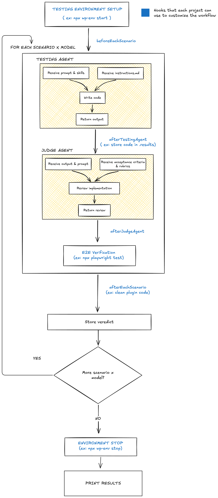
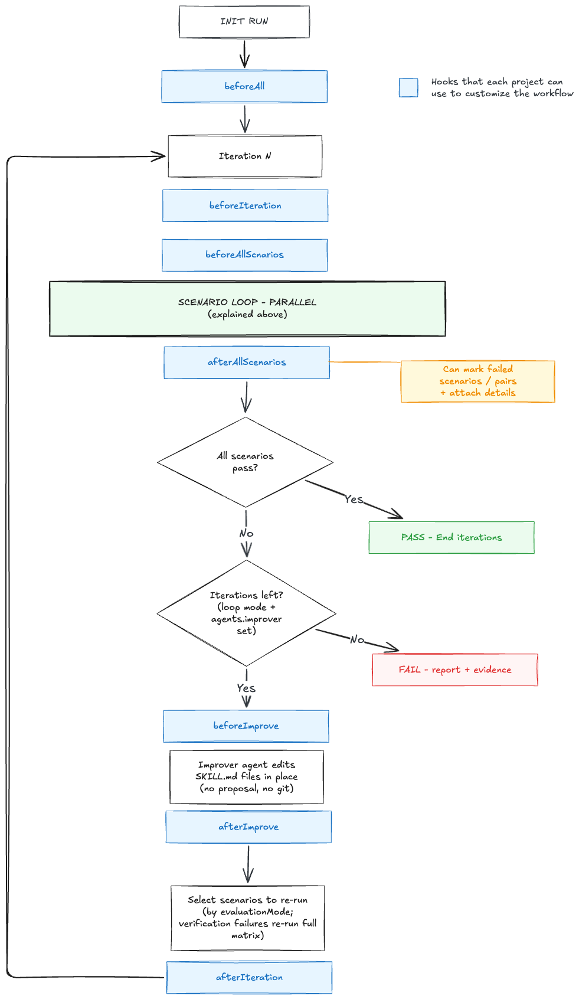

# Skillsmith

Landing page: <https://automattic.github.io/skillsmith/>

Skills are how we teach LLMs our domains — and today we ship them based on subjective review. Skillsmith is a harness with two parts: it **tests** a skill by sending prompts to an LLM and checking whether the resulting answer actually works, end-to-end in a real runtime, across models. When a test fails, a **self-improvement loop** kicks in: an agent edits the skill, re-runs the tests, and iterates until it passes — then opens a PR for human review. For anyone who builds, improves, or maintains a skill.

## The problem

Skills are now how we teach LLMs our domains. Every skill we ship determines the quality of the code and answers our teammates and users get. As skills proliferate, their defects compound.

Today, skills are written as prose and reviewed subjectively. We cannot systematically answer the questions that actually matter:

- Does this skill produce working output, end-to-end, when a real LLM consumes it?
- Did my latest edit to a reference file break anything?
- Does the skill hold up across models and across vendors?

Prose review cannot catch this. We need a test loop.

## Two parts

**Skill Tester.** Each test case is a **prompt** — the kind of request a user or agent would send. The pipeline sends the prompt to an LLM loaded with the skill, captures the answer, and validates it by executing it in a **real runtime**. The output is a pass/fail matrix per **(skill × model × test case)**.

**Self-Improvement Harness.** When tests fail, a single improver agent reads the failure trace, edits the skill files in place, re-runs the tests, and iterates (capped) until the suite passes or it gives up. It leaves the edits in the working tree alongside the full evidence trail, ready to review and open as a PR.

## How the Skill Tester works

The harness runs every scenario against every configured testing agent by default. A **scenario** is a prompt plus the skill(s) the agent should use to fulfil it. A **testing agent** is a configured (model, tools, system) tuple. Scenarios run in parallel; within each scenario, testing agents run in parallel.

### Usage

Run all scenarios:

```sh
skillsmith
```

Run one or more targeted scenarios by directory ID under `config.paths.scenarios`:

```sh
skillsmith counter
skillsmith counter config-fetch
```

Scenario selection trims each positional/API scenario value, then matches it exactly against scenario directory names under `config.paths.scenarios`, not `scenario.name` inside `scenario.yaml`. Empty selections run all scenarios. Unknown IDs fail before any hooks or agent work runs, and the error lists the available directory IDs.

No CLI flags are supported yet; option-like arguments such as `--scenario` fail before a run starts.

Project-specific behaviour is exposed through **hooks**. Each fork implements only the hooks it needs against the harness's runtime contract.



### Exit codes

The process exit code tells a CI pipeline or an autonomous consumer how the run ended:

- `0` — every executed evaluation passed and no declared agent was skipped.
- `1` — an agent that ran genuinely failed its evaluation (and nothing was skipped).
- `2` — a configuration error: one or more declared agents could not run because a required provider credential was missing. `2` takes precedence over `1`, so a run that has both a skipped agent and a genuine evaluation failure exits `2`.

A skipped agent never lets the run exit `0` — even when every agent that did run passed.

**When an agent can't run.** An agent backed by an API provider whose credential environment variable is unset (for example `OPENAI_API_KEY is not set`) is detected before it is ever invoked. It is removed from the run — it does no work, gets no workspace, contributes no pass/fail result, and is not re-selected in later iterations. It is announced **early — as soon as the misconfiguration is detected, before the run does its work — and again in the end-of-run summary**, each time in the console with its **id and reason**, under its own `SKIPPED AGENTS` heading that is visually distinct from a failing agent, and it is recorded in `report.json`. This is a configuration problem to fix, not a verdict on the skill — distinct from an agent that ran and failed its evaluation.

### Lifecycle

1. **Init run.** Generate `runId`, load scenarios from `config.paths.scenarios`, and apply any positional scenario directory filters.
2. **`beforeAll({ config, runId, scenarios })`**. `scenarios` is the filtered list of selected scenario directory IDs and parsed scenario bodies.
3. **Iteration directory.** Create `${runDirectory}/iteration-N/`. Test-only mode runs exactly one iteration; self-improvement mode (see below) may run more, each with its own subdirectory.
4. **Scenario loop — parallel.** For each scenario:
   1. **Init scenario.** Create the scenario directory inside the current iteration, load testing agents from `config.roles.test.agents` and the judge from `config.roles.judge` (both resolved against the top-level `config.agents` registry).
   2. **`beforeScenario({ config, runId, scenario })`**.
   3. **Agent loop — parallel.** For each testing agent:
      1. **Init agent.** Create the agent directory and `agentWorkspace`.
      2. **`beforeTestAgent({ config, runId, scenario, agentId, agentWorkspace })`**.
      3. **Testing agent.** Receives `scenario.prompt`, `scenario.skills`, and `agentWorkspace`; writes its output into the workspace.
      4. **`afterTestAgent({ config, runId, scenario, agentId, agentWorkspace })`**.
      5. **`beforeJudgeAgent({ config, runId, scenario, agentId, agentWorkspace })`**.
      6. **Judge agent.** Receives `scenario`, the rubrics it references, and `agentWorkspace`; produces a review verdict.
      7. **Agent report.** The harness writes `report.json` to the agent directory: a `testing` block with the testing agent's wall-clock `duration` (ms) and, when the provider reports it, `tokenUsage` (`inputTokens` — gross prompt size including the cache-read portion; `cachedInputTokens` — the subset that was served from the prompt cache; `outputTokens`; `totalTokens` = `inputTokens + outputTokens`); plus a `review` block — `{ pass: true }` on pass, otherwise the failing rubrics / acceptance items with the judge's notes inline.
      8. **`afterJudgeAgent({ config, runId, scenario, agentId, agentWorkspace })`**.
   4. **Scenario report.** The harness aggregates every agent's `report.json` into the scenario's `report.json`.
   5. **`afterScenario({ config, runId, scenario })`**.
5. **Iteration report.** The harness aggregates every scenario's `report.json` into `iteration-N/report.json` and writes the merged matrix across iterations to `${runDirectory}/report.json` plus an iteration roster to `${runDirectory}/run.json`.
6. **`afterAll({ config, runId, scenarios, iterations })`**.

### Hook examples

Projects opt into the hooks they need. Two examples from the WordPress reference project:

**`beforeTestAgent` — scaffold the artifact the agent will edit.** Generates a plugin skeleton inside `agentWorkspace` with a deterministic slug (`plugin-${scenario.name}-${agentId}`) so the e2e specs can activate it later.

**`afterAllScenarios` — run e2e tests against the artifacts this iteration produced.** Walks the iteration directory for the plugins built this iteration, writes a `.wp-env.json` listing them, then boots `wp-env`. wp-env auto-activates every listed plugin on start, so the hook sets `lifecycleScripts.afterStart` to `wp plugin deactivate --all` — leaving each spec a clean slate. It reads `ctx.skipped` (see [the hook context](#hooks)) to drop any skipped test agent, derives the runnable test-agent ids, and runs Playwright only against those — a skipped agent gets no Playwright project, no plugin build, and no spec, so the report attributes no e2e failure to it. It then invokes Playwright for the scenario specs that ran; each spec runs across the runnable testing-agent projects, activates its own plugin, sets up its fixtures (e.g. a post containing the block under test), and tears them down. Finally it stops `wp-env`, removes the generated `.wp-env.json`, and maps each failing spec back to its `(scenario, agent)` pair — returned as `failures` so a green judge but red e2e still fails the iteration. (For more on the loop this feeds, see [How the Self-Improvement works](#how-the-self-improvement-works).)

### Rubrics and the judge

A **rubric** is prose reference material the judge LLM consults — describing standards or best-practices — reusable across scenarios. Each scenario references one or more rubrics plus an inline `acceptance` list of per-scenario expectations.

**The judge does not read the skill.** The agent learns from the skill; the judge grades from the rubrics. Keeping them epistemically separate is what lets the harness catch a regression in the skill itself — if the judge consulted the same skill the agent did, a bad skill edit would simultaneously redefine "correct" and the regression would slip through.

**If the judge can't run, the run stops.** When the agent in `config.roles.judge` is misconfigured — its provider credential is missing (see [When an agent can't run](#exit-codes)) — there is nothing to grade against, so the run stops up front. The harness prints a single clear message naming the judge agent and the reason, and exits `2` before any work begins: no graded matrix and no `report.json` are produced. This is why a misconfigured judge dominates: when one id fills several roles, the most-severe consequence applies, so an id that is both the judge and a test agent (or the improver) stops the run regardless of its other roles.

## How the Self-Improvement works

When a run produces failures, the harness can loop: a single **improver** agent edits the failing skill, the affected scenarios re-run, and the loop stops when the suite passes or the iteration budget is exhausted. Self-improvement mode is opt-in (`mode: "self-improvement"`) — the default behaviour is the one-shot Skill Tester described above.

The scenario-evaluation half of each iteration (testing agents → judges) is exactly the Skill Tester [described above](#how-the-skill-tester-works); the diagram below collapses it into one node and details what the loop adds around it.



### Lifecycle

Every run lives under `${paths.base}/<runId>/`. Each iteration owns its own subdirectory; the top-level `report.json` is the merged matrix across iterations, and `run.json` lists the iterations themselves.

```
.skillsmith/20260512-123456/
├── run.json                       # iteration roster + final pass verdict
├── report.json                    # merged (scenario × agent) matrix
├── summary.txt                    # plain-text mirror of the console summary
├── iteration-1/
│   ├── report.json                # what ran this iteration (failures detailed)
│   ├── run.log
│   ├── improvement.md             # improver transcript (self-improvement mode, not yet passing)
│   └── <scenario>/<agent>/...     # workspaces and per-agent reports
├── iteration-2/
│   └── ...
```

1. **Iteration 1** runs every scenario (same as Skill Tester).
2. **Verification gate.** After the judges grade the scenario sweep, the optional `afterAllScenarios` hook fires (see below). Its return value can fail scenarios — or specific `(scenario, agent)` pairs — that the judges passed, folding those failures into the iteration report.
3. If the merged matrix is not yet passing and `mode === "self-improvement"`, the **improver** runs: it reads the failure summary (judge verdicts plus any verification details) and the text of every skill referenced by a failing scenario, then edits the files under `paths.skills` directly. It runs with `Read/Write/Edit/Glob/Grep/Bash`, jailed to the skills directory, and writes its transcript to `iteration-N/improvement.md`. There is no separate proposal or review step. `afterIteration` fires after this, so it sees the post-improve state — the iteration is not over until the improver has run.
4. **Iteration N+1** runs a subset of scenarios chosen by `selfImprovement.scope`:
   - `failed-pairs` — only (scenario, agent) pairs that failed last iteration.
   - `failed-scenarios` *(default)* — every agent of every failing scenario.
   - `all` — the full matrix.
   A scenario-level verification failure (no specific agent named) re-runs that scenario's full agent matrix. Scenarios that were not re-evaluated keep their previous verdict in the merged matrix.
5. The loop exits early on all-pass. If `finalPass: true` and the last iteration ran a subset, the harness runs one extra full sweep at the end so the final report reflects the current state of every (scenario, agent) pair.

The improver is the only agent that writes, and only inside `paths.skills`. The harness never commits, pushes, or captures a diff — your edits live in the working tree for human review. Set `roles.improver.prompt` to a string (or load one from disk) to replace the built-in improver instructions with a project-specific edit strategy.

If the improver agent can't run — its provider credential is missing (see [When an agent can't run](#exit-codes)) — the current iteration still runs to completion: the testing agents and judge produce a complete, valid matrix, and that verdict stands. The loop then halts: no improver call, no skill edits, and no further iterations (not even the `finalPass` sweep). The skipped improver is surfaced early — as soon as the misconfiguration is detected, before the run does its work — and again in the end-of-run summary, each time with its id and reason, and the run exits `2`.

### `afterAllScenarios` — the verification gate

The judges grade the *artifact a testing agent produced* against the rubrics. That is not always the same question as "does it actually work?" A block can read perfectly and still break when a real browser loads it.

`afterAllScenarios` closes that gap. It fires once per iteration, right after the scenario sweep is graded and before the improver, and it is **the one hook whose return value the harness consumes** (every other hook is fire-and-forget):

- return `true` (or nothing) — the iteration passes the gate untouched.
- return `false` — fail every scenario that ran this iteration (coarse).
- return `{ failures: [{ scenario, agent?, details? }] }` — fail exactly those scenarios, or `(scenario, agent)` pairs when `agent` is named. `details` is surfaced to the improver so it learns *why* the artifact broke beyond what the judge saw.

The harness only provides the mechanism; deciding which scenarios failed is the hook's job. The reference WordPress project uses it to build each plugin, boot `wp-env`, run the Playwright e2e specs for the scenarios that ran this iteration, and map each failing spec back to its `(scenario, agent)` pair — so a green judge but red e2e still fails the iteration and tells the improver to fix the underlying skill. Before driving Playwright it reads `ctx.skipped` and derives the runnable test-agent ids, running e2e only against those: a skipped agent gets no Playwright project, no plugin build, and no spec, so the report attributes no e2e failure to an agent that never ran.

### Per-iteration reports

Reports are deliberately compact. The per-agent `review` block collapses to `{ pass: true }` on pass; on failure it lists only the rubrics and acceptance items that failed, with the judge's notes inline:

```json
{
  "testing": {
    "duration": 12345,
    "tokenUsage": {
      "inputTokens": 1024,
      "cachedInputTokens": 512,
      "outputTokens": 128,
      "totalTokens": 1152
    }
  },
  "review": {
    "pass": false,
    "failures": [
      {
        "kind": "rubric",
        "id": "avoids-dom-manipulation",
        "notes": "Component uses document.querySelector inside render."
      },
      { "kind": "acceptance", "id": "uses fetch" }
    ]
  }
}
```

### Skipped agents in `report.json`

The merged `${runDirectory}/report.json` is `{ runId, pass, scenarios, skipped }`. The top-level **`skipped`** array is a sibling of `scenarios` — one entry per agent that could not run, carrying its `id`, the `roles` it fills, and the `reason`:

```json
{
  "runId": "...",
  "pass": false,
  "scenarios": { },
  "skipped": [
    { "id": "gpt", "roles": ["test"], "reason": "OPENAI_API_KEY is not set" }
  ]
}
```

A skipped agent has **no row in the matrix** — it is not a `scenarios` cell. That is what tells it apart from a graded failure (which lives inside `scenarios` as a failing cell) and from the per-cell `SKIPPED` marker that the judge can record for an individual `(scenario, agent)` result. A run with no skips leaves `skipped` empty (`[]`), so `report.json` reads exactly as it did before.

### Configuration

```ts
// skillsmith.config.ts
export default defineConfig({
  mode: "self-improvement",            // "test-only" (default) | "self-improvement"
  agents: {
    // Keyed by id — the key is the agent id used everywhere downstream.
    haiku: { provider: "claude-code", model: "claude-haiku-4-5" },
    opus:  { provider: "claude-code", model: "claude-opus-4-7" },
  },
  roles: {
    // Reference agents by id. Single-agent roles accept a string shorthand.
    // The same agent can play multiple roles — `opus` is both judge and improver here.
    test: { agents: ["haiku"], prompt: "be terse and avoid emojis" },
    judge: "opus",
    // Replace the built-in improver instructions with a project-specific strategy.
    improver: { agent: "opus", prompt: "..." },
  },
  selfImprovement: {
    maxIterations: 3,                   // default 3
    scope: "failed-scenarios",          // "failed-pairs" | "failed-scenarios" | "all"
    finalPass: false,
  },
  hooks: {
    // Optional: fail iterations whose artifacts pass review but break for real.
    afterAllScenarios: ({ iteration, iterationDirectory, scenarios }) => {
      // ...run e2e tests, return failures...
    },
  },
});
```

`roles.test.prompt` and `roles.judge.prompt` are appended to the respective system prompts as a `# Role instructions` section, augmenting the harness-owned structural blocks. `roles.improver.prompt` replaces the built-in improver instructions entirely. When `roles.improver.prompt` is not set, the harness uses a minimal built-in instruction ("edit the failing skills in place, minimally, no git").

See [`examples/skillsmith.config.ts`](./examples/skillsmith.config.ts) for a reference config showing every provider (`claude-code`, `anthropic-api`, `openai-api`, `codex`, `gemini-api`), provider-specific options like `effort`, and the full set of hooks and `selfImprovement` knobs.

### CLI flags

Flags override the config block for a single invocation:

```
skillsmith --mode self-improvement --iterations 5 --scope failed-pairs --final-pass
```

### Hooks

The base hooks (`beforeAll`, `beforeScenario`, ...) still fire. The iteration adds these, in firing order:

| Hook | Fires |
| --- | --- |
| `beforeIteration` | once per iteration, before anything else |
| `beforeAllScenarios` | just before the scenario sweep begins |
| `afterAllScenarios` | after the judges grade the sweep, before the improver — its return value can fail scenarios/pairs (see [the verification gate](#afterallscenarios--the-verification-gate)) |
| `beforeImprove` / `afterImprove` | around the improver call (self-improvement mode, when not yet passing) |
| `afterIteration` | last, after the improver — so it sees the post-improve state |

Each receives the iteration number, the iteration directory, and (for `afterImprove`) `improvementPath`. `afterAllScenarios` is the only hook whose return value the harness consumes; the rest are fire-and-forget.

Every hook context also carries a readonly **`skipped`** field — `ReadonlyArray<{ id, roles, reason }>`, the same data as `report.json`'s top-level [`skipped` array](#skipped-agents-in-reportjson). It is present from `beforeAll` onward (the skip set is fully known before the run starts) and lists each agent that could not run, with the `roles` it fills and the `reason`. It adds no mandatory callback — a hook that does not need it ignores it. The reference project's `afterAllScenarios` reads it to exclude skipped agents from the e2e run (see [the verification gate](#afterallscenarios--the-verification-gate)).

## Installation

`npm install -D @automattic/skillsmith`

Requires Node.js ≥ 20.17.

## Releases

- Per-version changes: [`CHANGELOG.md`](./CHANGELOG.md).
- All releases: <https://github.com/Automattic/skillsmith/releases>.

## Contributing

See [`CONTRIBUTING.md`](./CONTRIBUTING.md) — first-timers start at [Adding a changeset](./CONTRIBUTING.md#adding-a-changeset).
